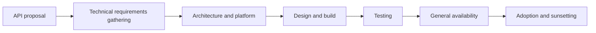

# Chpater 3 API Specifications and Implementation
We have chosen a design-first approach for implementation to make our development process understandable for non-technical stakeholders as well. To make this approach possible, we will make use of the **OpenAPI Specification** (OAS) to, first, design an API and, later, implement it. 

We’ll cover the following topics as part of this chapter:

* Designing APIs with OAS
* Understanding the basic structure of OAS
* Converting OAS to Spring code
* Implementing the OAS code interfaces
* Adding a Global Exception Handler
* Testing the implementation of the controllers

##  Designing APIs with OAS
You should use the **design-first approach**.

We’ll use version 3.0 of OAS (https://github.com/OAI/OpenAPI-Specification/blob/main/versions/3.1.0.md) to implement the e-commerce app REST API. We’ll use YAML (pronounced as yamel, rhyming with camel), which is cleaner and easier to read. YAML is also space-sensitive. It uses space for indentation; for example, it represents the key: value pair (pay attention to the space after the colon – :). You can read more about YAML at https://yaml.org/spec/.

We’ll make use of the following Swagger tools in this chapter:

* **Swagger Editor**(https://editor.swagger.io/): This tool is used to design and describe the e-commerce app REST APIs. It allows you to write and preview, at the same time, your REST APIs’ design and description. Make sure that you use OAS 3.0. Its beta version is available at https://editor-next.swagger.io/.
* **Swagger Codegen**(https://github.com/swagger-api/swagger-codegen): This tool is used to generate the Spring-based API models and Java interfaces. You’ll use the Gradle plugin (https://github.com/int128/gradle-swagger-generator-plugin) to generate code that works on top of Swagger Codegen. There is also an OpenAPI tool Gradle plugin – OpenAPI Generator (https://github.com/OpenAPITools/openapi-generator/tree/master/modules/openapi-generator-gradle-plugin). However, we’ll opt for the former one because of the open issues count, which is 3.2k (there are multiple for Java/Spring as well) at the time of writing.
* **Swagger UI**(https://swagger.io/swagger-ui/): This tool is used to generate the REST API documentation. The same Gradle plugin will be used to generate the API documentation.

More information on OpenAPI specifications is at https://spec.openapis.org/oas/v3.1.0 .

###  ⚠ Modify the generated code from openapi-generator-maven-plugin to a real implementation 
* dependency libraries: `${project.basedir}/target/generated-sources/openapi/pom.xml`
* readme.md: `${project.basedir}/target/generated-sources/openapi/README.md`
* Key points: ``${project.basedir}/src/main/resources/api/.openapi-generator-ignore``. If the file ``.openapi-generator-ignore`` is empty , the controller is generated.


### API Documentation Standards: OpenAPI, RAML, and API Blueprint
The daunting task of API documentation is keeping the documentation in sync with the actual implementation. If you take a bottom-up approach and create the API documentation manually after the implementation, you risk the documentation falling out of sync if there are enhancements to the API interface in the next version, especially if the process does not enforce regeneration or validation of the API document.

Similarly, with a top-down approach, you may start with the API documentation and manually create the skeleton of the API interface according to the defined interface. But later, you still risk the API documentation getting out of sync with the actual implementation when enhancements are required.

This challenge can only be addressed if there are tools that autogenerate API documentation from the API interface in a bottom-up approach or tools that generate the API skeleton and client code from the API interface document in a top-down approach. Standards and tools based on these approaches are needed to aid API documentation.

#### RAML
RAML stands for **RESTful API Markup Language**. More information on RAML specifications is at https://raml.org/developers/document-your-api .
* **API Workbench**  is a tool by **MuleSoft** that provides a full-featured integrated development environment (IDE) that design, build, test, document, and share RESTful APIs.
* **API Designer**(https://github.com/mulesoft/api-designer) is a tool from **MuleSoft** that allows users to see real-time post-processing of their API definition.
* **Restlet Studio**(http://restlet.com/products/restlet-studio/#) provides a lightweight IDE that can help accelerate API design.
* **API Notebook** is another RAML tool by **MuleSoft**. It helps with live testing and exploring APIs.

#### API Blueprint
API Blueprint is a document-oriented language for describing REST API using **Markdown syntax**. This specification, brought in by **Apiary.io**, uses Markdown syntax to describe the complete specification of an API or its parts.
* **Apiary.io** provides a comprehensive tool that supports the collaborative design, creation of API mockups, automated testing, autogeneration of interactive API documentation, API traffic inspection, and more.
* **Dredd** is an HTTP API testing tool. It is a command-line tool that can be used to test the API documentation written in API Blueprint against the back-end implementation. This tool can be integrated with CI tools to ensure up-to-date API documentation.
* **Drakov** provides a Node.js implementation of a mock server for APIs written using API Blueprint.

### Comparing OpenAPI, RAML, and API Blueprint
* Table 1 Overview Comparison   

| Criteria                     | OpenAPI                | RAML     | API Blueprint |
|------------------------------|------------------------|----------|---------------|
| Format                       | JSON, YAML             | YAML     | Markdown      |
| Availability on Web          | GitHub                 | GitHub   | GitHub        |
| Primary sponsor              | Linux Foundation       | MuleSoft | Apiary        |
| Is there a workgroup?        | Yes                    | Yes      | No            |
| When was it first committed? | Jan-16                 | Sep-13   | Apr-13        |
| Design approach              | Top-down and bottom-up | Top-down | Top-down      |
| Current version              | 3.1.0                  | 1        | A4            |

 * Tool Support

 | Criteria           | OpenAPI                                  | RAML                                     | API Blueprint                         |
|--------------------|------------------------------------------|------------------------------------------|---------------------------------------|
| Authoring tool     | Swagger.io                               | API Designer                             | Apiary.io                             |
| Ad hoc testing     | Swagger UI                               | API Console                              | Apiary.io                             |
| Documentation      | Supported                                | Supported                                | Supported                             |
| Mocking            | Extended support provided by third party | Extended support provided by third party | Extended support provided third party |
| Server code        | Supported by third party                 | Supported by third party                 | Supported by third party              |
| Client code        | Supports multiple languages              | Supports multiple languages              | Supports a few languages              |
| Generate from code | Supported by Java (third party)          | Supported by third party                 | Supported by third party              |
| Validation         | Supported                                | Supported                                | Supported                             |
| Parsing            | Java.js                                  | Java.js                                  | C++(Node.js, C#)                      |

* REST Modeling Capabilities

| Criteria                 | OpenAPI                                            | RAML                                                   | API Blueprint                                  |
|--------------------------|----------------------------------------------------|--------------------------------------------------------|------------------------------------------------|
| Resources                | Supports resource definition                       | Supports resource definition                           | Supports resource definition                   |
| Nested resources         | Supports nested resource definition                | Supports nested resource definition                    | Supports nested resource definition            |
| Representation metadata  | Supports the JSON schema                           | Supports inline and external definitions in any format | Supports only inline definitions in any format |
| Composition/ inheritance | Inheritance supported by subtypes                  | Supports inheritance of traits and resource types      | Supports resource model inheritance            |
| API version metadata     | Supported via version tag                          | Supported via version tag                              | No explicit tag to specify the API version     |
| Authentication           | Tags defined to support Basic, API Key, and OAuth2 | Supports Basic, Digest, and OAuth2                     | Supported via custom header definitions        |
| Methods/action           | Supported                                          | Supported                                              | Supported                                      |
| Query parameters         | Supported                                          | Supported                                              | Supported                                      |
| Path/URL parameters      | Supported                                          | Supported                                              | Supported                                      |
| Header parameters        | Supported                                          | Supported                                              | Supported                                      |
| Documentation            | Supported                                          | Supported                                              | Supported                                      |

### The Scope of API Governance

#### API proposal
| Title              | Description                                             |
|--------------------|-----------------------------------------------------------------------------------------------------------------------------------------------------------------------------------------------------------------------------------------------------------------------------------------------------------------------------------------------------------------------------------------------------------------------------------------------------------|
| Input              | • New API requests made by business analysts and solution architects. An outline solution document for the new API is to be submitted for review.<br/>• Solution architects can make API change requests, and submit an outline solution document for the API. |
| Process            | For new APIs<br/>• New API request/business agreement to be submitted for review.<br/>• API details will be completed in a template that captures the API requirements. It should highlight the use cases related to the API. This evaluates the alignment of the API to business needs. The template must also highlight the information model and the related entities that are used by the API. This explains the business assets that are API-enabled. The service interface definition of the API should also be documented at this stage.<br/>• Design lead, tech architect, and solution architect review the submitted API proposal. The architecture review board should approve the proposal. The approval process can be similar to an existing SDLC. A lighter version of the existing approval process can be followed for API proposals.<br/>• A governance review by the architecture review board (ARB) of the new API proposal decides whether the API should be built.<br/><br/>For API change requests<br/>• Business analysts/solution architects submit a change request for an existing API.<br/>• API details will be completed in the same template as a new API.<br/>• ARB governance review of the API change request decides whether the API should be built.<br/> |  
| Output             | • API profile template document with API specification for new APIs.<br/> • Updated API profile template for API change requests.<br/>• A new project (for a CR, there is a new version of the project) for the creation of an API.<br/>|
| Checkpoint         | • Fortnightly or monthly governance reviews are organized to review new API requests or change requests. The frequency may change depending on the business needs for the APIs.<br/> |
| Exit Preconditions | • Resourcing availability for API development (an API team to be formed).<br/>• The ARB or API governance body should review and approve an API spec.<br/>• Funding for API development should be approved by business and other stakeholders.<br/>|
| Actors and Roles   | • API business owner: Responsible for establishing and validating the API’s business needs and the funding approval requirements.<br/> • API product owner: Responsible for interfacing with various API delivery teams to ensure the quality and delivery of the APIs. They must ensure that APIs are built to meet the business requirements.<br/>  • API spec lead: Responsible for the creation of API specifications.<br/>  • API architect: Responsible for the technical architecture of the API solution.<br/>• API leadership team: Responsible for validating the business requirements and providing funding to build the API. |
#### Technical requirements gathering
| Title              | Description                                                                                                                               |
|--------------------|-------------------------------------------------------------------------------------------------------------------------------------------|
| Input              | • API profile template                                                                                                                    |
| Process            | • Create API specifications document from the business requirements.<br/>• Define data mappings between API interfaces and back-end services.<br/> • Requirements should be stored and/or updated in a central requirements management tool.|
| Output             | • API specification and data mappings document                                                                                            |
| Checkpoint         | • Review with the business analyst and the API architect, and sign off the API specification.                                             |
| Exit Preconditions | • Governance guidelines and rules followed<br/>• API profile requirements are updated in JIRA  | 
| Actors and Roles   | • API business analyst: Gathers the business requirements for API enablement and identifies the services to be exposed as APIs.<br/>• API solution architect: Works with the business analyst to define the API specification document and data mapping to back-end services.<br/>• API spec lead: Defines the API specifications and works with the business analyst and solution architect.<br/>• API project team: Informed about the new API requirements at this stage. Review the API specifications.<br/>• API governance committee: Ensures that the process is followed, criteria are met, and quality is maintained.<br/>• Scrum master: Conducts a spec jam.|

#### Architecture and platform
Soon after the technical requirements for the APIs have been defined, the enterprise and API architects need to create the logical and physical architecture for the API implementations. During the architecture and platform setup phase, the governance processes must define and establish guidelines for the following.
* Goals and objectives for API architecture and infrastructure
* Constituent of the cross-functional governance team
* Roles and responsibilities of an API architect, API developer, tester, and administrator
* Policies, standards, and best practices for API design, development, and usage
* Policies and standards for authentication, authorization, data format, versioning, error handling, and documentation of the APIs
* Review and approval process for API design, build, test, and deployment
* Testing procedures and quality assurance checks during the API development lifecycle
* API monitoring and performance measurement tools and processes to measure the latency, throughput, and error rates
* Strategy for high availability and disaster recovery of the API platform infrastructure
* API delivery and promotion processes
* The process to accommodate changes in API technology, business needs, and industry trends
* Overall enforcement and accountability to adhere to policies and standards throughout the API delivery lifecycle
#### Design and build
| Title              | Description |
|--------------------|------------------------------------------|
| Input              | • Approved API specification and data mapping documents<br/>• Business requirements document|
| Process            | In the API design and build phase, the API team consists of a scrum master, API architect, API designer, API developers, and DevOps team, who build the API per specifications and business requirements. API development is done in two to three weeks sprints using the agile development methodology. The high-level activities are as follows.<br>• The scrum master grooms the requirements and fills the action log in a requirements management tool like JIRA.<br>• The API development lead reviews the API specifications, captures comments, and updates action logs.<br>|
|                    | • The API teams are responsible for the following.<br>&nbsp;&nbsp;&nbsp;&nbsp;• Reviewing the specification, updating the business agreement (after revival), and updating action logs<br>&nbsp;&nbsp;&nbsp;&nbsp;• API implementation<br>&nbsp;&nbsp;&nbsp;&nbsp;• Committing to SCM <br>&nbsp;&nbsp;&nbsp;&nbsp;• Code review<br>&nbsp;&nbsp;&nbsp;&nbsp;• Demoing to the client and validation by the client <br>&nbsp;&nbsp;&nbsp;&nbsp;• Publishing deployable artifacts to the repository<br>&nbsp;&nbsp;&nbsp;&nbsp;• Updating developer portal links<br> &nbsp;&nbsp;&nbsp;&nbsp;• Publishing information on the developer portal for API subscribers<br>|
| Output             | • Completed action list captured during previous discussions<br>• Follow-up action plan created in action log<br>• Reference implementation running in development <br>• Artifacts uploaded to a repository like GitHub<br>• Developer portal updated <br>| 
| Checkpoint         | • Implementation should be compliant with the API specification document (mappings are validated)            |
| Exit Preconditions | • Final review (config review, demo to the client)  <br> • Governance guidelines and rules followed   <br> • API conformant to design guidelines  <br> • API versioning policies followed  <br> • Any deviations are documented  <br>|
| Actors and Roles   | • API program manager: Responsible for the overall program delivery of the APIs.  <br> • API architect: Architects the API solution and defines the API REST interface.  <br> • API designer: Designs the API interfaces and API proxy configurations to be deployed on the API gateway. <br>• API developers: Configures API proxies in the API gateway. <br>  • API DevOps: Builds a DevOps framework to support CI and CD for API enablement.  <br> |
#### Testing
| Title              | Description                              |
|--------------------|------------------------------------------------------------------------------------------------------------------------------------------------------------------------------------------------------|
| Input              | • Approved API specification and data mapping documents<br/> • Business requirements document<br/>• Test Strategy<br/>• APIs deployed on non-prod environments|
| Process            | In the API testing phase, the API testing team works to validate and ensure that the APIs are built as per the API specifications and business requirements. The API test team executes the test cases using the right and approved API testing tool. API interfaces are tested to validate that they work as per the specifications. The testing must validate the API behavior for mandatory and optional parameters in the request and response. Appropriate error must be thrown for missing mandatory parameters in the API request. Once the interface has been validated, API testing should test for end-to-end integration and functional testing. Performance and load testing should be done with the APIs deployed on a production-like infrastructure by simulating real traffic for normal and peak times. Defects and issues found during the testing cycles must be reported and tracked till closure.<br/>• Creating test plans and test cases<br/>• Executing test cases of API Interface testing <br/>• Executing integration test cases for end-to-end functional testing<br/>• Executing API security and penetration test cases.<br/>• Raising defects for issues observed during the testing.<br/>• Executing performance and load testing to validate non-functional requirements.<br/> |
| Output             | The output of API testing should provide a clear understanding of the quality and performance of the APIs. The output should include the following.<br/>• Test execution results for functional, security, performance, and load testing<br/> • Prioritized defect list <br/>• Detailed and summary test report of overall testing results indicating the number of passed and failed tests<br/>• Performance metrics with response time, throughput, and latency for each API <br/>• Security findings with vulnerabilities discovered.<br/>• Logs and debug information for the reported issues to troubleshoot and resolve them |
| Checkpoint         | • API testing should be conducted at different stages throughout the API development life cycle. Unit, integration, and regression testing should be automated and integrated with CI/CD pipelines to be executed frequently with every code drop and release.<br/>• Security and performance testing should be done for the release of every new API or new version.<br/>• All test cases are executed. <br/>• Test results and reports are documented.<br/>• Defects for unresolved issues logged.<br/>• API test governance guidelines and rules followed.<br/> |
| Actors and Roles   | • API program manager: Responsible for ensuring the quality of API program delivery.<br/>• API designer: Clarifies any doubts about the API design to facilitate testing. <br/> • API developers: Executes unit test cases and resolves issues reported at different stages of API testing.<br/> • API testers: Creates automated and manual test cases. Execute test cases to test API interfaces and business functionality.<br/>• API DevOps: Integrates API test suites with CI and CD pipelines for automated API testing.|
#### General availability
| Title            | Description                                                                                       |
|------------------|---------------------------------------------------------------------------------------------------|
| Input            | • API interface definition in the repository<br/>• API test console availability<br/>• Developer portal updated<br/>• Pre-prod environment running reference implementation<br/>• API config uploaded to SCM or repository<br/>|
| Process          | The following activities are performed during the general availability phase to publish the APIs.<br/>• API deployment from the repository to sandbox and production<br/>• API documentation published on the developer portal for API subscribers<br/>• API health monitoring is set up<br/>• APIs are released to consumers for testing and feedback<br/>• App developers access APIs and create apps using the APIs<br/>|
| Output           | • APIs deployed to sandbox and production environments<br/>• API documentation is updated in the developer portal<br/>• Apps built using the APIs<br/>  |
| Checkpoint       | • Check the API’s running status<br/> • Check API documentation and test console in the developer portal<br/>• Check API analytics for API traffic and performance<br/>• API health monitors are configured<br/>|
| Actors and Roles | • Project team: Responsible for overall API delivery.<br/>• API support team: Support to resolve reported issues.<br/>• Operations/run team: Deploys APIs and monitors their health.<br/>|

#### Adoption and sunsetting
| Title            | Description                                                 |
|------------------|-------------------------------------------------------------|
| Input            | • The number of developers signed up<br/>• API traffic reports<br/>• The number of hits on the developer portal<br/>• The number of mentions on social networks<br/>• The number of blogs and forum posts<br/>|
| Process          | • During the adoption phase of an API, it is important to have a plan that facilitates easy onboarding of developers and apps and tracks the usage of the API. For this, the following activities need to be performed. |
|                  | • Develop an adoption plan and identify targets.<br/>• Target and inform specific development communities about the availability of the new API.<br/>• Target/organize hackathons to support adoption.<br/> • Track/follow up with members who are in the member adoption<br/>• Update the adoption list, developer portal, and API<br/>• Ensure the publicity of API through various developer channel.<br/>• Identify and inform other ecosystems of API availability.<br/>• Conduct webinars driven by members to share experiences in adoption.<br/>|
| Checkpoint       | • The number of developers and apps onboarded <br/>• The number of active developers and apps<br/>• API traffic patterns<br/>• The number of API issues reported from different channels<br/>|
| Actors and Roles | • API operations team: Facilitates the developer onboarding and monitors API<br/>• API support team: Resolves issues reported about the APIs.|

# Summary
In this chapter, we opted for the **design-first** approach to writing RESTful web services. You learned how to write an API description using OAS and how to generate models and API Java interfaces using the Swagger Codegen tool (using the Gradle plugin). We also implemented a Global Exception Handler to centralize the handling of all the exceptions. Once you have the API Java interfaces, you can write their implementations for business logic. Now, you know how to use OAS and Swagger Codegen to write RESTful APIs. You also now know how to handle exceptions globally.

In the next chapter, we’ll implement fully fledged API Java interfaces with business logic with database persistence.

# Questions
1. What is OpenAPI and how does it help?  
1. How can you define a nested array in a model in a YAML OAS-based file?  
1. What annotations do we need to implement a Global Exception Handler?  
1. How can you use models or classes written in Java code in your OpenAPI description?  
1. Why do we only generate models and API Java interfaces using Swagger Codegen?  
# Answers
1. OAS was introduced to solve at least a few aspects of a REST API’s specification and description. It allows you to write REST APIs in the YAML or JSON markup languages, which allows you to interact with all stakeholders, including those who are non-technical, for review and discussion in the development phase. It also allows you to generate documentation, models, interfaces, clients, and servers in different languages.
1. The array is defined using the following code:
   ```
    type: arrayitems:  type: array  items:    type: string
   ```
1. You need a class annotation, @ControllerAdvice, and a method annotation, @ExceptionHandler, to implement the Global Exception Handler.
1. You can use --type-mappings and --import-mappings rawOptions in the swaggerSources task of the build.gradle file.
1. We only generate the models and API Java interfaces using Swagger Codegen because this allows the complete implementation of controllers by developers only.
# Further reading
* OAS 3.0: https://github.com/OAI/OpenAPI-Specification/blob/master/versions/3.0.3.md
* The Gradle plugin for OpenAPI Codegen: https://github.com/int128/gradle-swagger-generator-plugin
* OAS Code Generator configuration options for Spring: https://openapi-generator.tech/docs/generators/spring/
* YAML specifications: https://yaml.org/spec/
* Semantic versioning: https://semver.org/